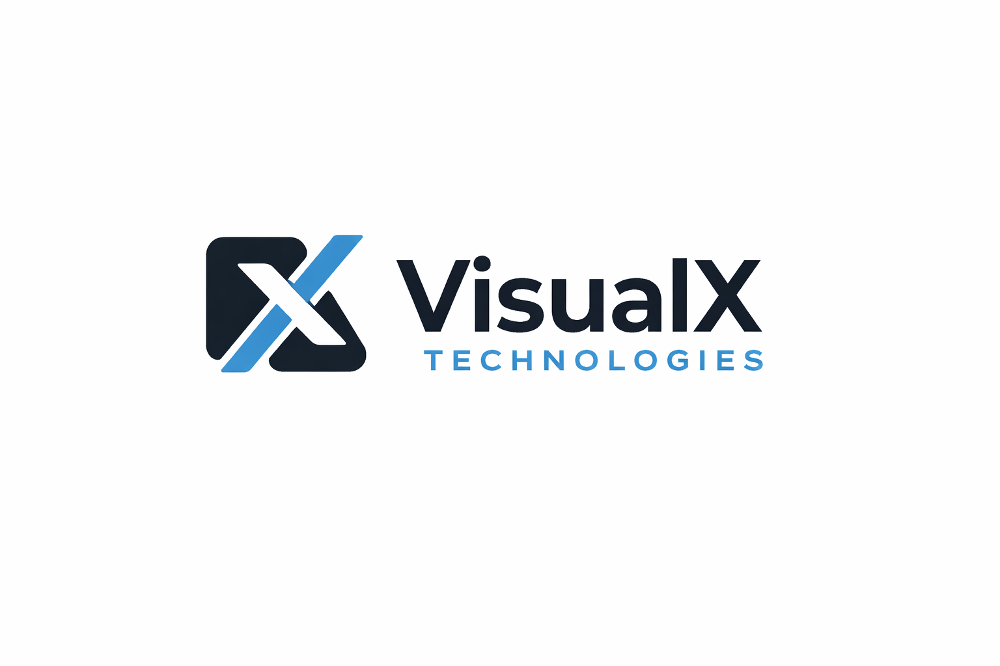

<p align="center">
  
</p>

<h1 align="center">VisualX Technologies — Service Agreement Generator</h1>

<p align="center">
  A professional <strong>Electron desktop application</strong> for generating, customising, and exporting legally-sound Service Agreements — built for <strong>VisualX Technologies</strong>.
</p>

<p align="center">
  
  
  
  
  
</p>

---

## ✨ Features

- **12-Step Guided Form Wizard** — walks you through every section of a professional Service Agreement
- **Live Contract Preview** — see the formatted legal document update in real-time as you fill the form
- **PDF Export** — download a print-ready A4 PDF with a single click
- **Signature Upload** — embed signature images (PNG/JPG/SVG) from both parties directly in the document
- **Session Persistence** — all form data is saved in-session so you never lose your work
- **Optional Clauses** — add an NDA (Annexure A) or Annual Maintenance Contract (Annexure B) with one toggle
- **Professional Legal Document** — 15 fully-drafted sections covering scope, payment, IP, confidentiality, dispute resolution, force majeure, and more
- **Indian Number System** — amounts auto-formatted in ₹ and converted to words (e.g., *"Fifty Thousand Only"*)
- **Dark-Mode UI** — premium glassmorphism design with micro-animations

## 📋 Agreement Sections Covered

| # | Section |
|---|---------|
| 1 | Parties Involved (Company & Client) |
| 2 | Scope of Services |
| 3 | Technology Stack |
| 4 | Payment Terms & Milestones |
| 5 | Project Timeline & Phases |
| 6 | Revisions & Change Requests |
| 7 | Client Responsibilities |
| 8 | Confidentiality |
| 9 | Intellectual Property Rights |
| 10 | Termination & Refund Policy |
| 11 | Warranty & Limitation of Liability |
| 12 | Support & Maintenance (SLA) |
| 13 | Dispute Resolution & Arbitration |
| 14 | Force Majeure |
| 15 | General Provisions |
| — | **Annexure A** — NDA *(optional)* |
| — | **Annexure B** — Annual Maintenance Contract *(optional)* |

---

## 🚀 Getting Started

### Prerequisites

- [Node.js](https://nodejs.org/) v18 or higher
- npm v9 or higher

### Installation

```bash
# Clone the repository
git clone https://github.com/YOUR_USERNAME/visualx-contract-form.git
cd visualx-contract-form

# Install dependencies
npm install
```

### Development

Runs the React dev server + Electron window simultaneously:

```bash
npm run electron:dev
```

### Production Build

Builds the React app and packages it as a desktop installer:

```bash
npm run dist
```

Distributable files will be generated in the `release/` folder.

---

## 🗂️ Project Structure

```
visualx-contract-form/
├── electron/
│   ├── main.js          # Electron main process (window creation)
│   └── preload.js       # Context bridge / preload script
├── public/
│   └── logo.png         # VisualX Technologies logo
├── src/
│   ├── components/
│   │   ├── FormWizard/  # 12 step form components
│   │   ├── Layout/      # Header & Sidebar
│   │   ├── Preview/     # Legal document renderer
│   │   └── UI/          # Reusable Button, Input, Toggle, etc.
│   ├── context/
│   │   └── ContractContext.jsx   # Centralised state (useReducer)
│   ├── data/
│   │   └── defaultValues.js      # Form defaults & tech stack
│   ├── utils/
│   │   ├── formatCurrency.js     # ₹ formatting & number-to-words
│   │   └── exportPdf.js          # html2pdf.js integration
│   ├── App.jsx
│   ├── App.css
│   ├── main.jsx
│   └── index.css        # Global design system & CSS tokens
├── index.html
├── vite.config.js
└── package.json
```

---

## 🛠️ Tech Stack

| Layer | Technology |
|---|---|
| Desktop Runtime | Electron |
| Frontend Framework | React 18 |
| Build Tool | Vite 5 |
| Styling | Vanilla CSS (custom design system) |
| State Management | React Context + useReducer |
| PDF Export | html2pdf.js |
| Packaging | electron-builder |

---

## 📦 Available Scripts

| Script | Description |
|---|---|
| `npm run dev` | Start Vite dev server only |
| `npm run electron:dev` | Start Vite + Electron in development mode |
| `npm run build` | Build React app for production |
| `npm run electron:build` | Package Electron app (current platform) |
| `npm run dist` | Full production build + package |

---

## 🏢 About VisualX Technologies

VisualX Technologies is a software company specialising in web development, web applications, desktop application development (Electron), and digital design (UI/UX, thumbnail editing, brand identity).

---

